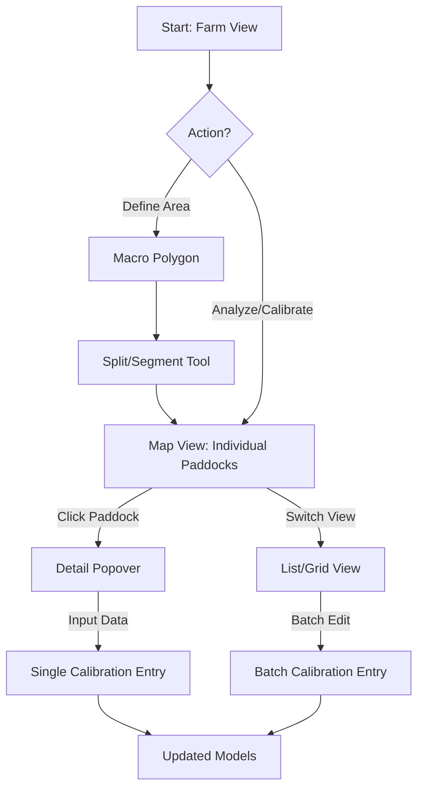

# UX/UI Design: Interactive Paddock & Calibration Strategy

**Goal:** Create a fluid interface that maximizes visual interaction (Map) for granular decisions and offers efficiency (Grid) for batch operations.

**License Note:** All recommended libraries (Leaflet-Geoman Free, TanStack Table) are MIT Licensed and free for commercial use.

---

## 1. Flow Overview



---

## 2. Visual System: Status & Alerts

To allow quick scanning of the farm status, we use a consistent Color and Icon coding system on both Map and List views.

| State | Color Code | Icon | Description |
| :--- | :--- | :--- | :--- |
| **Normal / Healthy** | 🟢 Green (`#22c55e`) | (None) | Processing complete, no anomalies. |
| **In Processing** | 🔵 Blue Pulse (`#3b82f6`) | ⏳ | Calculation in progress (Serverless Batch). |
| **General Alert** | 🔴 Red (`#ef4444`) | ⚠️ | Critical issue (e.g., NDVI drop > 20%). |
| **Warning** | 🟡 Yellow (`#eab308`) | ⚡ | Attention needed (e.g., Low Calibration). |

**Specific Indicator Icons (Badges):**
*   💧 **Water Stress** (NDWI low)
*   🦠 **Disease Risk** (NDRE anomaly)
*   📉 **Yield Risk** (Prediction < Calibration)

---

## 3. Mockup 1: Map Monitoring View (Visual Status)

**Context:** Day-to-day monitoring. User looks at the map to see problems.
**Visuals:** Polygons fill color = NDVI (low opacity), Border = Status Color. Icons centered.

```text
+---------------------------------------------------------------+
|  VIVACAMPO  [Farm View]                                       |
+---------------------------------------------------------------+
| [ Filters: (x) Alerts Only  ( ) Processing ]                  |
|                                                               |
|        .-----------------------------.                        |
|       /   Talhão 01  /   Talhão 02  /                         |
|      /  (🟢 Normal) /  (🔴 Alert)  /                          |
|     /      0.72    /      0.55    /                           |
|    /______________/__________⚠️___/                           |
|        .-----------------------------.                        |
|       /   Talhão 03  /   Talhão 04  /                         |
|      /  (🔵 Proc.)  /  (🟡 Warn)   /                          |
|     /      ⏳      /      0.68  💧/                           |
|    /______________/______________/                            |
|                                                               |
+---------------------------------------------------------------+
```

---

## 4. Mockup 2: Field Input & Calibration (Granular)

**Context:** User clicks on "Talhão 02" (Red status).

```text
+---------------------------------------------------------------+
|                                            [X] Close Panel    |
|  TALHÃO 02 - ⚠️ ALERT ACTIVE               Status: CRITICAL   |
|  Reason: NDVI drop (-15%) detected yesterday.                 |
+---------------------------------------------------------------+
|  [ INDICATORS ]                                               |
|  NDVI: 0.55 🔴 (Low)                                          |
|  NDWI: 0.20 🟡 (Moderate Water Stress 💧)                     |
|  [Chart: Drop clearly visible vs History]                     |
+---------------------------------------------------------------+
|  [ FIELD CALIBRATION ]                                        |
|  "Did you inspect this area?"                                 |
|  [ Log Issue ] [ Mark False Positive ]                        |
+---------------------------------------------------------------+
```

---

## 5. Mockup 3: Batch Data Grid (Status Overview)

**Context:** Overview of all paddocks status.

```text
+---------------------------------------------------------------+
|  FARM OVERVIEW                                 [ Download CSV ]|
+---------------------------------------------------------------+
|  Filter: [ ⚠️ Alerts (3) ] [ ⏳ Processing (5) ]              |
+--------------+-----------+------+--------------+--------------+
|  PADDOCK     | STATUS    | NDVI | EST. YIELD*  | REAL YIELD **|
+--------------+-----------+------+--------------+--------------+
|  Talhão 01   | 🟢 Ok     | 0.72 | 64 sc/ha     | [ 65.0 ]     |
|  Talhão 02   | 🔴 Alert  | 0.55 | 40 sc/ha     | [ 68.5 ]     |
|  Talhão 03   | 🔵 Proc.  | --   | --           | [ ____ ]     |
|  Talhão 04   | 🟡 Warn   | 0.68 | 50 sc/ha     | [ 62.0 ]     |
|  ...         | ...       | ...  | ...          | ...          |
+--------------+-----------+------+--------------+--------------+
| * Based on Regional Model                                     [ SAVE BATCH ] |
| ** Editable Column                                                           |
+------------------------------------------------------------------------------+
```

---

## 6. Implementation Notes
*   **Map Rendering:** Use `Leaflet` Polygon `color` (border) and `fillColor` properties dynamically based on status state. Use `L.divIcon` to place emojis/icons (⚠️, 💧) at the `polygon.getCenter()`.
*   **Real-time:** Use WebSocket or SWR Polling to animate the "Processing" state (Blue Pulse) until it turns Green.
